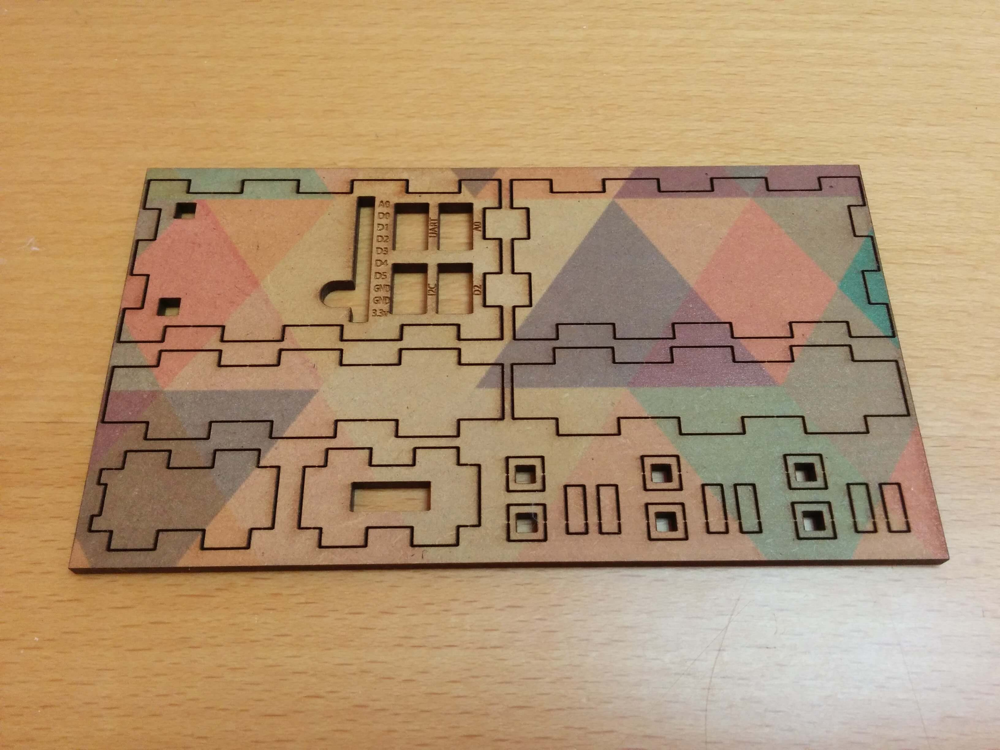
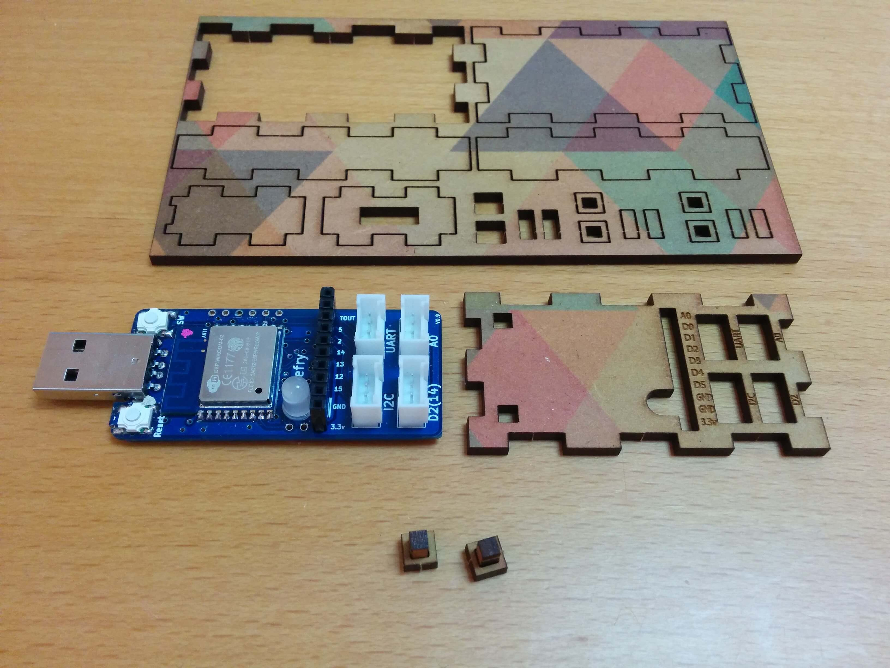

# ケースをつくってみる
	1.ケースの加工
縦10㎝、横13㎝以上、厚さ3㎜程度（厚みは±0.5㎜程度であれば問題ないです。）のMDFをレーザ加工機で切り出します。  
加工データは[イラストレーターのAIデータ](https://nefry.studio/data/nefry.ai)で公開していますので、ぜひお使いください。  
もしMDFに柄をつけたい場合、レーザ加工機で切り出す前にUVプリンタで印刷するとよいでしょう！

	2.切り出したケース

手順1で切り出したMDFがこちらになります。
切り出していらない部分は捨ててしまって構いません。

この状態になったら、これから順に組み立てていきます。

レーザ加工機で加工している関係上、手がよごれてしまうことがありますので、ウエットティッシュなどがあるとよいでしょう

#ケースを組み立ててみよう

	1.トップパネルとボタンを外します

それでは早速組み立てていこうと思います。

まずはトップパネルとボタンのパーツをそれぞれ写真を参考にしながら取ってください。  
ボタンは部品が小さいのでつまようじなどを使って取るとよいかもしれません。

ボタンについては3つついております。  
これから使う1つ以外は予備ですので、無くしたり、壊してしまったときに使ってください。

	2.ボタンを組み立てます

ボタンは縦長の細長い部品を四角く穴の開いている部品に差し込めば完成です。

MDFの特性上、水分が多い環境で組み立てるとあまりうまく刺さらない場合がありますが乾かしてからリベンジしてもらうとうまくいきやすいです。

しっかりと奥まで差し込んで次に進んでいきましょう！

	3.トップパネルを裏返し、そこにボタンをはめます

先ほどつくったボタンをトップパネルに差し込みます。

写真の状態のまま、Nefryを裏返してちょうど穴にはまるように差し込みます。

MDFの状態によってはNefryが刺さりにくいときがありますが、頑張って刺してください。

	4.Nefryをはめ込みます

奥まで差し込んでもらうとこのように刺さっている状態になると思います。

ここまでうまくできたら次のステップに進んでいきます。

	5.次に側面となる部分を外します

次に写真を参考に側面となるパーツを外していきます。

これを順に組み立てていきます。

先に短いパーツから組み立てていくとよいでしょう。  
USBがあるところに穴が開いているほうを差し込み、その反対にもう一つのの短いパーツをトップパネルにはめ込みます。

その次に長いパーツをトップパネルにはめ込んでいきます。  
こちらのパーツは向きがないのでお好みでどちらかに差し込んでください。

	6.はめこみます

無事にそれぞれのパーツをはめ込むとこのようになっているはずです。

ここまで来たら完成は近いです！

	7.最後に底面をはめ込めば完成です

最後に残っている大きなパーツである底面をはめ込めば、ケースは完成です！！

お疲れ様でした！！

