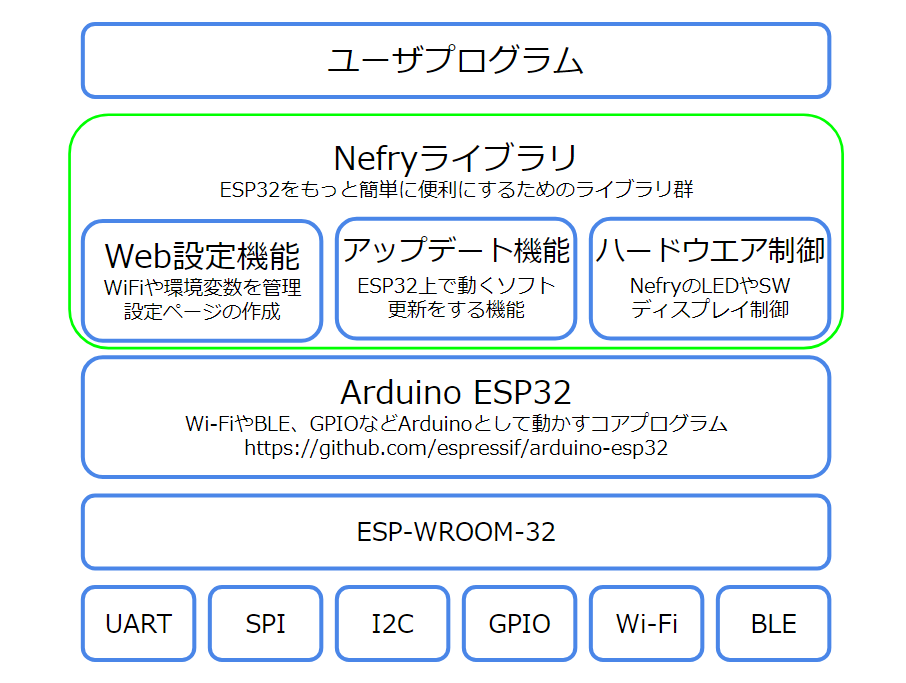

# Nefryライブラリとは？

Nefryライブラリとは、ESP8266やESP32で動作するNefry v2やNefry BTなどのハードウェアを簡単に動作するようにしたライブラリです。

無線LANの設定やモジュールの設定、環境変数の設定などができます。
上の機能を使って実際に作りたいものに特化してプログラムを作ることができます。

Nefry BTを例に説明していきます。

上記の図がNefryライブラリのスタックになります。

Arduino ESP32をベースにその上にNefryライブラリを載せているのが分かると思います。
随時ベースとなっているArduino ESP32のアップデートを行っていきます。

Nefryライブラリの起動手順について説明します。

基本的には上の図を確認していただけると分かると思いますが、書き込みモードについて説明していきます。

書き込みモードとは、ライブラリのみの動作をするモードでオンラインアップデートなどを行うときに使うとよいモードになります。
書き込みモードに移行するには、Nefryの起動中にSWを押すことでそちらのモードに切り替えることができるほか、Webページから書き込みモードに切り替えることができます。

## どんなことができるの？(ソフトウエア)

Nefryのハードウエア×ソフトウエアで難しいIoTを簡単に扱えるようにしています。  

Nefryが出力しているWiFiに接続すると自動的にWebページが立ち上がり様々な設定ができます。  

- WiFiの設定ページ  
[WiFi関連関数のページ](http://nefry.studio/NefryLibrary/WiFi関連関数/)  
Nefryに5つまでのWiFiを記憶させることができ、WiFiに接続するときに最も適したものに接続します。  
WiFiを検索して、簡単に保存することができます。Nefryに保存済みのWiFi Listを削除することもできます。

- Nefryの各種設定ページ  
[DataStore関連関数のページ](http://nefry.studio/NefryLibrary/Module関連関数/)  

Nefryに対して様々な設定ができます。Nefryに名前を付けたり、Nefryが出力するWiFiにパスワードを付けることができます。  
他にも環境変数として、文字列8つと数値8つ扱うことができ、その値はプログラムから扱うことができます。  
この環境変数を上手く使うとサクッと設定値を変更することができるのでプログラムの幅が広がります。

  

- Nefryコンソール  
[Console関連関数のページ](http://nefry.studio/NefryLibrary/Console関連関数/)  
NefryにはWeb上で確認できるコンソールがあります。  
ページ内で入力することもできます。  
Nefryから取得して表示間隔も変更できます。  

## どんなことができるの？(ハードウエア)
[ハードウエア関連関数のページ](http://nefry.studio/NefryLibrary/ハードウエア関連関数/)  

- フルカラーLED  
RGBで色を指定して光らせることができます。
- SW  
スイッチがもともと付いているので、簡単にハードウエアを試すことができます。
- Grove  
Groveのソケットが付いておりセンサーやディスプレイを簡単に繋げられます。
- ソケット  
Grove以外にもソケットが出ているため、Arduinoと同じようにLEDやセンサーを繋げることができます。
