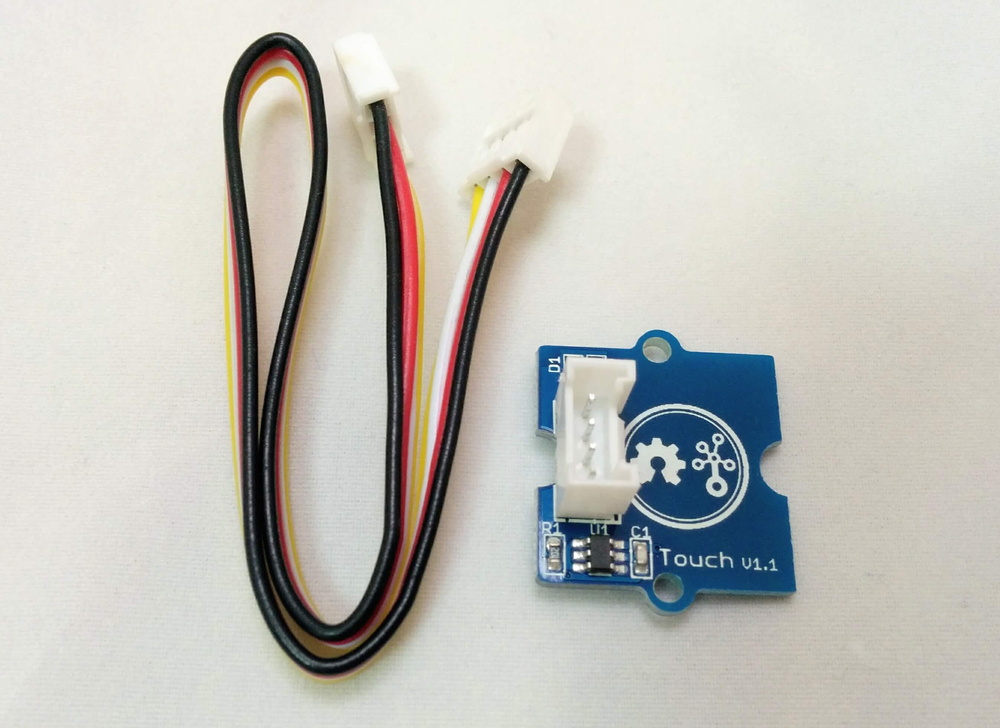

# Groveタッチセンサ

  

タッチセンサはスイッチの代わりに指を近づけることで反応します。
静電容量方式で動いており、直接触らなくても近づいたことを検知することができます。

このセンサーはデジタル出力で、タッチした時HIGHを出力します。

## 仕様

|||
|:--:|:--:|
|動作電圧|2.0v-5.5v|
|動作電流(VCC=3v)|1.5 - 3.0μA|
|動作電流(VCC=5V)|3.5 - 7.0μA|
|出力応答時間|60 - 220ms|
|IC|TTP223-BA6|

## 動作確認

|Nefry|
|:---:|
||

##サンプルプログラム

詳細データ 
http://wiki.seeed.cc/Grove-Touch_Sensor/
